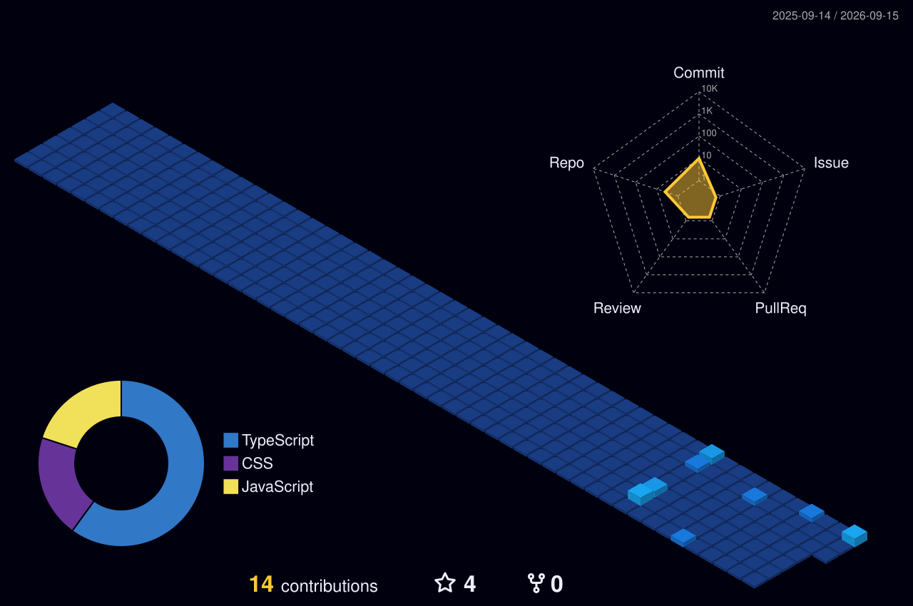

  
  <!-- Header Banner -->
  

   

  <!-- Badges -->
  

    
    
    
  

---

### 👋 About Me

I'm **Aarav**, a **Computer Science & AI Student** and passionate **Python Developer**. I love building web applications, exploring the world of AI Agents, and diving deep into Machine Learning & Generative AI. Always eager to learn new technologies and apply AI concepts to real-world projects.

- 🎓 Currently pursuing **B.Tech CSE (AI)** at **NIET**, Delhi
- 🐍 Specializing in **Python Development** and modern web technologies
- 🤖 Exploring **Machine Learning, Generative AI & AI Agents**
- 💡 Passionate about building **real-time collaborative** applications

---

### 🛠️ Tech Stack & Skills

  <table>
    <tr>
      <td align="center" width="140"><b>Languages</b></td>
      <td align="center" width="140"><b>Frontend</b></td>
      <td align="center" width="140"><b>Backend</b></td>
      <td align="center" width="140"><b>Tools</b></td>
    </tr>
    <tr>
      <td align="center">
         
         
        
      </td>
      <td align="center">
         
         
         
        
      </td>
      <td align="center">
        
      </td>
      <td align="center">
         
         
        
      </td>
    </tr>
  </table>

---

### 📊 GitHub Statistics

  
  

  

---

### 🧊 3D Contribution Graph

  

---

### 🐍 Snake Eating My Contributions

  <picture>
    <source media="(prefers-color-scheme: dark)" srcset="https://raw.githubusercontent.com/Aaravsingh1507/Aaravsingh1507/output/github-snake-dark.svg" />
    <source media="(prefers-color-scheme: light)" srcset="https://raw.githubusercontent.com/Aaravsingh1507/Aaravsingh1507/output/github-snake.svg" />
    
  </picture>

---

> *"The future belongs to those who believe in the beauty of their dreams."* — Eleanor Roosevelt

### 🤝 Let's Connect

- 💼 Connect with me on [**LinkedIn**](https://www.linkedin.com/in/aarav-singh-821806388)
- 🔍 Check out my [**Repositories**](https://github.com/Aaravsingh1507?tab=repositories) and feel free to ⭐ anything you find interesting!

---

  ⚡ Built with passion by <b>Aarav Singh</b>

